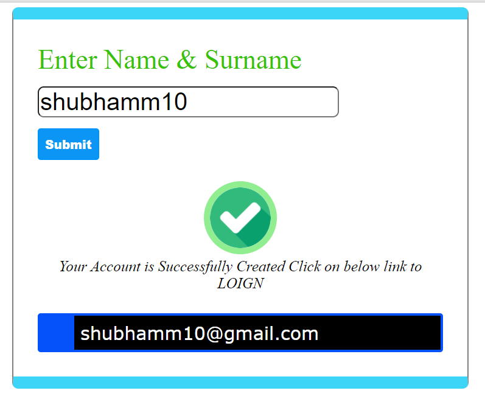

  

<h1 align="center"> LOGIN-FORM 
A normal Login form, using switch case statement in javascript.
</h1>

  

  
  

<h2><i>NOTE:-</i> CSS is added but the form is not responsive on all devices.</h2>
 <h2>You can Download the code 👆 from the ZIP FILE uploaded (Login Form.zip)</h2>

